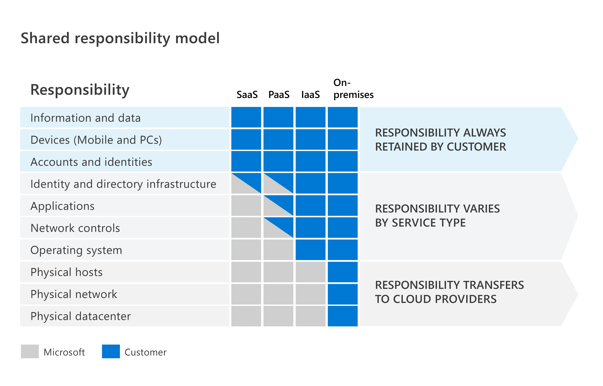
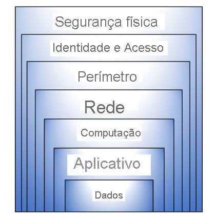
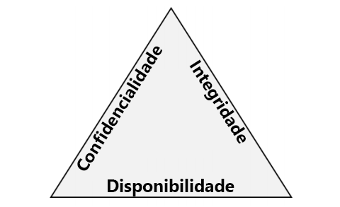
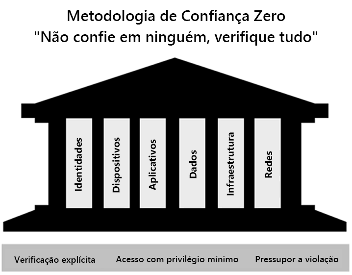
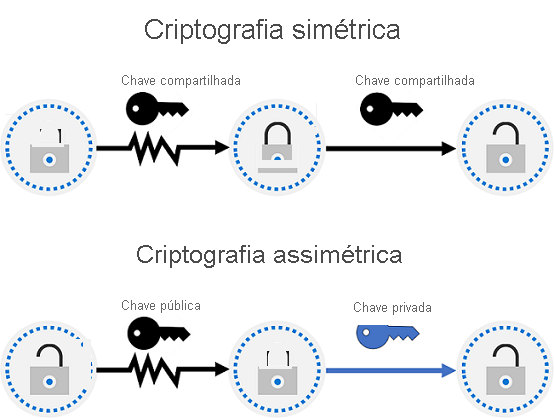
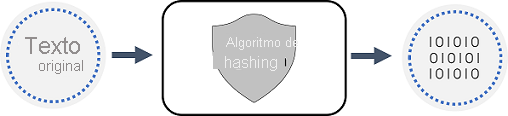
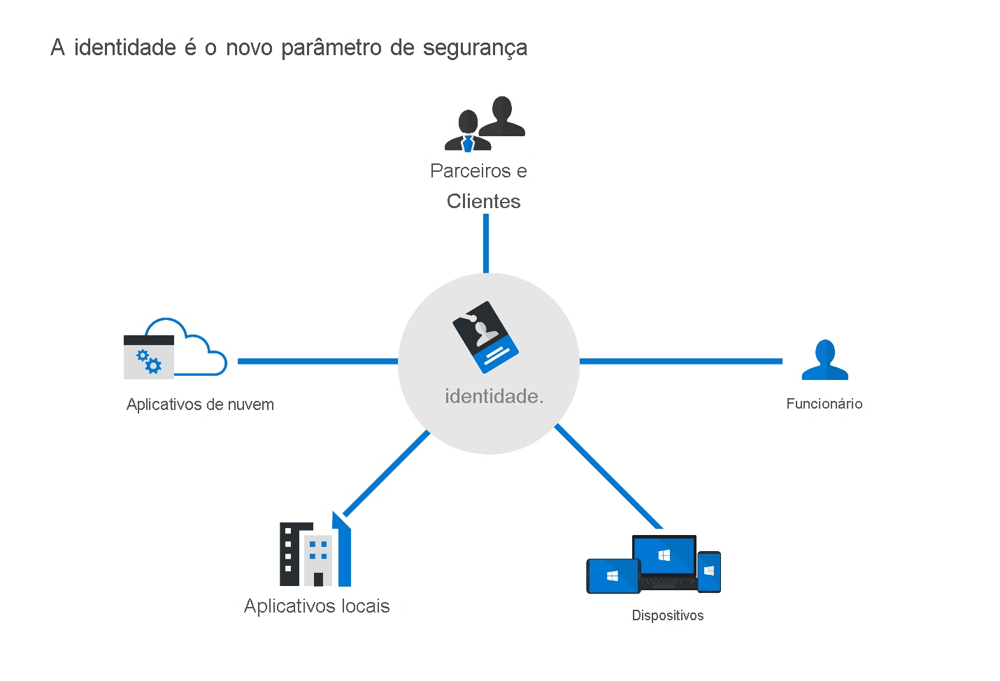
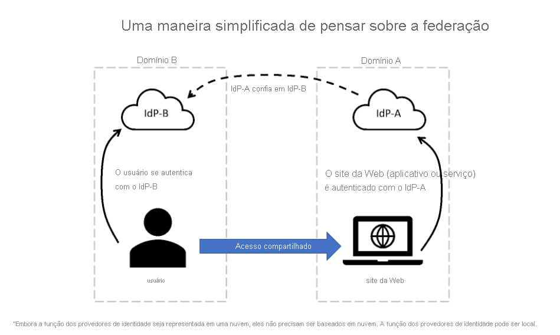

# Módulo 1 - Conceitos de segurança, conformidade e identidade

## Conceitos de segurança e conformidade

### Modelo de responsabilidade compartilhada (Microsoft x Cliente)

### Defesa em profundidade

Segurança física: limitar acesso apenas a pessoal autorizado
Identidade e acesso: MFA, acesso baseado em condição
Perímetro: proteção contra DDoS
Rede: segmentação e controles de acesso à rede
Computação: proteção de acesso às VMs, local ou nuvem, com fechamento de portas
Aplicativo: garantir que estejam seguros e livre de vulnerabilidades
Dados: gerenciar acesso aos dados de negócio e clientes, criptografia

### CIA

### Zero Trust

* Verificação explícita
* Acesso com privilégio mínimo
* Pressupor violação

### Seis pilares fundamentais do modelo Zero Trust

### Criptografia e Hash

​	Temos também:

* Criptografia para dados em repouso
* Criptografia TLS para dados em trânsito
* Criptografia para dados em uso

### Hash

### Conceitos de conformidade

- Residência de dados: os dados devem seguir regulamentos sobre os locais físicos, onde são armazenados e como e quando podem ser transferidos, processados ou armazenados internacionalmente.

- Soberania de dados: os dados são sujeitos a regulamentos do país/região onde são coletados fisicamente, mantidos ou processados. O mesmo dado pode ser coletado em um país, mantido em outro e processado em um terceiro país por exemplo.

- Privacidade de dados: fornecer avisos e ser transparente sobre a coleta, processamento, uso e compartilhamento de dados pessoais. Dados pessoais são dados que se relacionam a uma pessoa e que a torna identificada e identificável.

## Conceitos de identidade

### Autenticação x Autorização

Autenticação: "Cara-crachá"
Autorização: "Siga para a suíte x, andar y."

### Identidade como o perímetro de segurança primário

Estamos em uma nova realidade. Colaboradores, usuários e outras pessoas precisam colaborar de qualquer lugar, qualquer dispositivo, sem afetar a produtividade.

Temos que expandir a ideia de perímetro para além da rede local, como por exemplo para:
- Apps SaaS para cargas de trabalho críticas, hospedadas fora da rede corporativa;
- Dispositivos pessoais
- Dispositivos não gerenciados de parceiros ou clientes
- IoT

A Identidade virou o novo perímetro de segurança.
O que é Identidade? 

Identidade é um conjunto de coisas que caracterizam alguém ou algo. 
Identidade de uma pessoa por exemplo, é normalmente algo que tem informações que determinam que Fulano é Fulano mesmo, como nome de usuário, senha, nível de autorização, etc.

Quatro pilares de uma infraestrutura de identidade (os 4 A's):
- Administração
- Autenticação
- Autorização
- Auditoria

### Função do Provedor de Identidade (IdP)

Temos um resumo sobre a Autenticação moderna.
Um IdP cria, mantém e gerencia informações de identidade e fornece serviços de autenticação, autorização e auditoria. 
A grosso modo, é um facilitador/centralizador de logins, como por exemplo quando criamos uma conta em um site específico mas com uma conta do Google, Facebook, etc.
O IdP nos auxilia a termos o SSO (Single Sign-on), ou seja, este mecanismo de uma única credencial ter acesso a vários sites, recursos. 

### Conceito de serviços de diretório e o AD DS

Serviço de diretório armazena dados de diretório, para serem disponibilizados para os usuários na rede, administradores, serviços e aplicativos.
O antigo AD era um conjunto de serviços de diretório parte do Windows 2000 para redes locais baseadas em domínio.
Temos o AD DS (AD Domain Services), que fornece vários recursos para administrarmos o domínio da organização, administrarmos a rede local.
Um servidor que executa o AD DS é chamado de DC (controlador de domínio).
O AD DS não possui suporte nativo a mobile, aplicativos SaaS ou apps de linha de negócio que exigem métodos de autenticação moderna.

Já o Azure AD fornece uma solução de IDaaS para todos os apps locais e na nuvem.
Este curso em si, é mais focado no Azure AD.

### Federação e AD FS

Damos o nome de "relação de confiança", quando um IdP confia em outro IdP.
O exemplo acima é praticamente idêntico a acessar um site qualquer, porém autenticando com uma conta do Google ou Facebook.
Atenção: nem sempre a relação de confiança é bidirecional. Somente é bidirecional caso seja configurada como tal.
