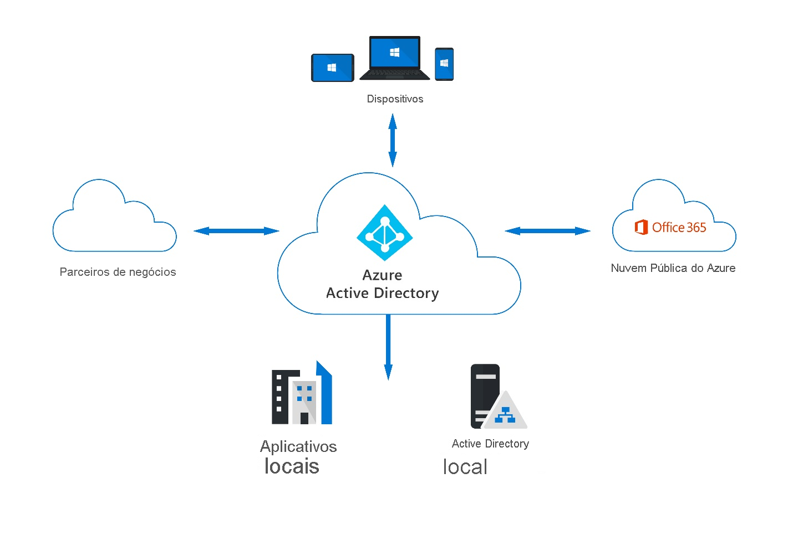
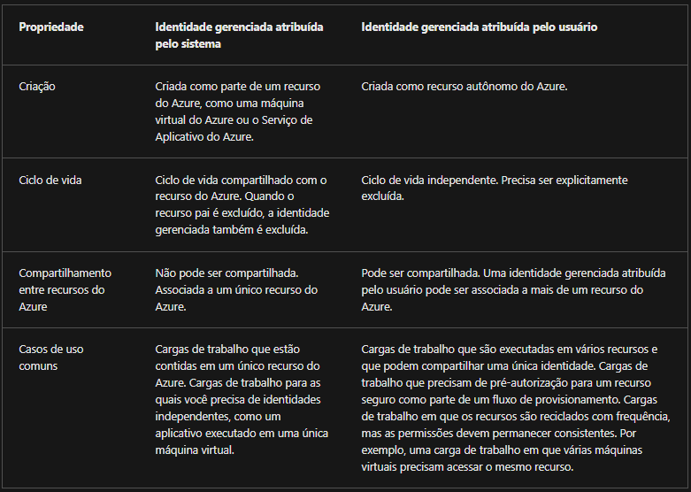
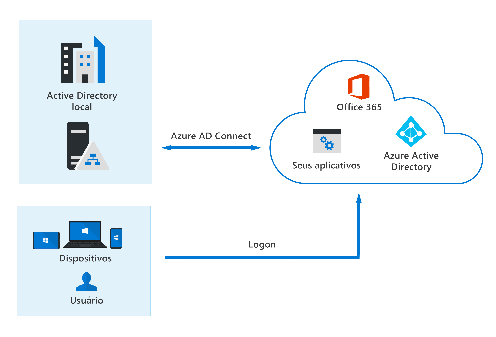
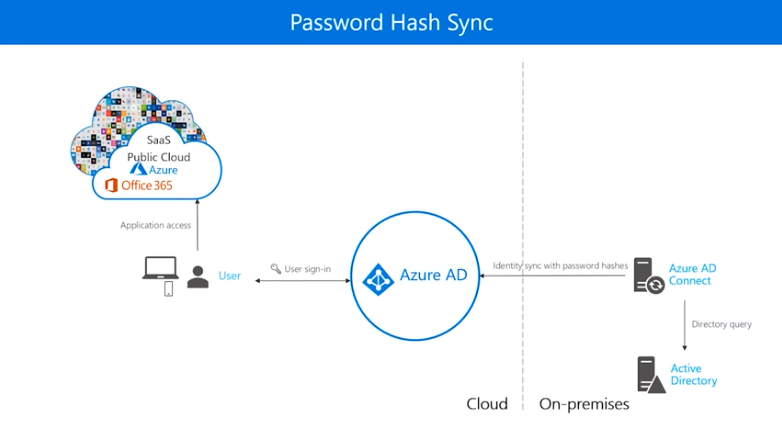
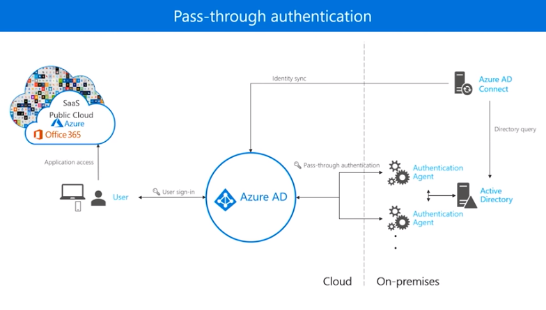
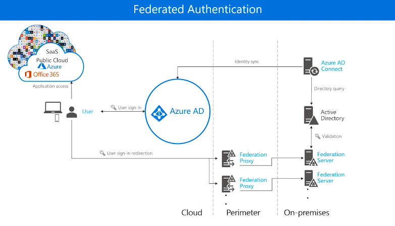

# Módulo 2 - Funcionalidades do Azure AD, parte do Microsoft Entra

## Serviços e tipos de identidade no Azure AD

### Descrever o Azure AD

O Azure AD é o serviço de gerenciamento de acesso e identidade baseado em nuvem.
Utilizamos na organização o Azure AD, para permitirmos funcionários e convidados ou outras pessoas a utilizarem recursos internos ou serviços internos (adquiridos com terceiros como por exemplo o Microsoft 365, aplicativos SaaS, portal do Azure, etc.).
Ele pode ser sincronizado com o AD local, usando como serviço autônomo ou com outros serviços de diretórios.
Outros recursos:
- Simplificar o gerenciamento de acesso
- Habilitar uso de dispositivos pessoais
- Controlar o acesso a aplicativos e recursos, com base em função (RBAC)
- Configurar a exigência de MFA
- Automatizar provisionamento de usuários entre Windows Server AD existente e os aplicativos na nuvem
- Ferramentas automatizadas para proteção de identidades e para aderência a requisitos de governança de acesso na organização
- Fornece APIs para auxiliar os desenvolvedores a criarem experiências personalizadas nas aplicações

Quem tem o Azure AD?

\- Assinantes do Azure, Microsoft 365 corporativo, Dynamics 365. Estes podem também fazer upgrade para licenças do Azure AD Premium. 

### Edições disponíveis

- Azure AD gratuito - inclusa no Office 365, Azure, Dynamics 365, Intune e Power Platform
  - Administrar e criar usuários
  - Sincronizar com AD Local
  - Criar relatórios básicos
  - Configurar Alteração de senha Self-service para usuários na nuvem
  - Habilitar SSO no Azure, Microsoft 365 e vários apps SaaS

- Aplicativos do Office 365 - inclusa nas assinaturas do Office 365 E1, E3, E5, F1 e F3
  - Redefinição de senha Self-service e write-back de dispositivo
  - Sincronização bidirecional entre diretórios locais e o Azure AD

- Azure AD Premium P1
  - Suporte a administração avançada
  - Grupos dinâmicos
  - Gerenciamento de grupo de autoatendimento
  - Microsoft Identity Manager
  - Recursos de write-back de nuvem

- Azure AD Premium P2
  - Azure AD Identity Protection, que fornece acesso condicional baseado em risco
  - Azure AD Privileged Identity Management, para descobrir, restringir e monitorar os administradores e o acesso a recursos, como também fornecer acesso Just-In-Time

- Licenças de recurso para pagamento conforme o uso. Exemplo: Azure AD B2C

- Tipos de identidade no Azure AD

- - Usuário
  - Entidade de serviço: identidade para um aplicativo
  - Identidade gerenciada: identidade para aplicativos, em que não há necessidade dos desenvolvedores gerarem credenciais.

#### Tipos de Identidades gerenciadas:

\- Atribuída pelo sistema: quando habilitamos essa identidade em uma instância de um serviço. E, se esse serviço é excluído, também é excluída essa Identidade gerenciada. Somente o recurso do Azure pode usar essa identidade para solicitar tokens do Azure AD.

\- Atribuída pelo usuário: quando nós mesmos criamos a identidade em si como um recurso autônomo do Azure. Este tipo pode ser atribuído a uma ou mais instâncias de serviços do Azure. Gerenciamos este tipo de identidade separadamente dos serviços que utilizam ela.

- * Dispositivos

- - - Registrados no Azure AD: para cenários de BYOD. Compatível com Windows, Android, iOS e macOS.
    - Ingressados no Azure AD: normalmente para dispositivos da própria corporação.
    - Ingressados no Azure AD híbrido: para ingressados tanto no Azure AD, quanto no AD local.

Por que registrar ou ingressar dispositivos? Para trazermos o SSO aos usuários destes dispositivos. Os ingressados têm os benefícios de SSO para recursos e aplicativos que dependem do AD local.

Podemos usar ferramentas como o Microsoft Intune, para contolarmos como os dispositivos serão usados na organização.

O Intune é uma ferramenta de MDM (gerenciamento de dispositivo móvel) e MAM (gerenciamento de aplicativos móveis). 

### Tipos de identidades externas

- Utilizamos para permitir usuários externos a utilizarem os recursos da organização.
- Estes usuários externos podem "trazer suas própria identidades" para se conectar.
- Para tal, temos que configurar o mecanismo de Federação com IdPs externos, como outros locatários do Azure AD, Facebook, Google ou provedores de identidades empresariais.
- Estão disponíveis nos planos P1 e P2 e o preço é calculado em usuários ativos mensais (ou MAU = monthly active users).

Há dois tipos de identidades externas: B2B e B2C.
- B2B nos permite compartilhar aplicativos e recursos com usuários externos. Podemos enviar um convite ao usuário e o mesmo efetua o resgate. Ou podemos criar fluxos de trabalho para os usuários tenham um autoatendimento, para solicitar acesso a recursos.
Há o suporte para SSO em todos os aplicativos conectados no Azure AD.

- B2C nos traz uma solução CIAM (Gerenciamento de Acesso de Identidade do Cliente) para gerenciarmos identidades voltadas para o consumidor final. Permite que nossos clientes autentiquem com identidades como por exemplo do Facebook, Google, etc.
  Dá suporte a milhões de usuário e bilhões de autenticações por dia.
  Cuida do dimensionamento, segurança na plataforma que fazem autenticação, monitoramento e tratamento automático de ameaças, como DDoS, irrigação de senha (password spray) ou ataques de força bruta.
  Estes usuários ficam nos diretórios do Azure AD B2C, separados dos funcionários e parceiros da organização. Também há suporte para SSO.
  Nos permite também customizar a tela de autenticação com a logo da empresa.

### Identidade Híbrida

São identidades que permitem o usuário ter acesso a todos os recursos, independente da localização.
Requer termos na organização além do Azure AD, também o AD local.
Utilizamos Azure AD Connect executando em um servidor, para fazer a ponte entre o AD local e o Azure AD.

Temos 3 tipos de autenticação para as identidades híbridas:
- Sincronização de hash de senha (hash sync)

* Autenticação de passagem (pass-through authentication)

* Autenticação federada (federated authentication)

